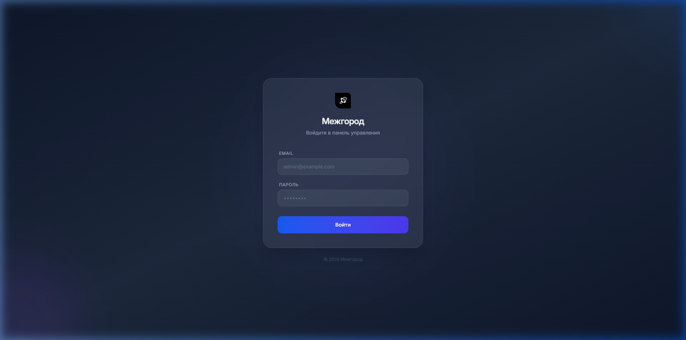
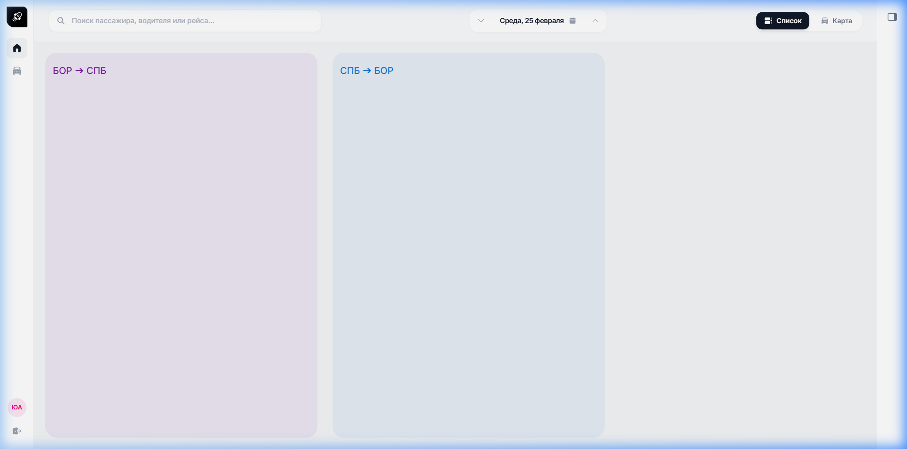
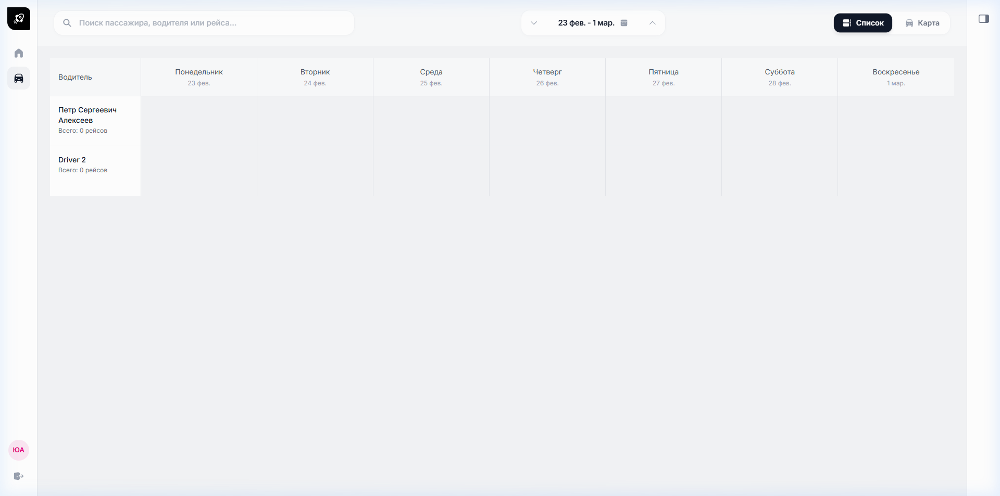
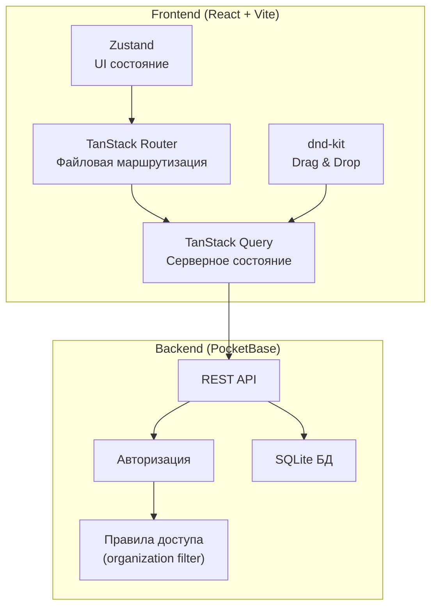

## О проекте

**Межгород** — веб-приложение для управления межгородскими пассажирскими рейсами. Позволяет диспетчерам транспортной компании управлять рейсами, назначать водителей, отслеживать бронирования и планировать расписание на неделю вперёд.

Проект решает реальную задачу автоматизации работы диспетчерской службы, заменяя Excel-таблицы и бумажные журналы на интерактивный веб-интерфейс с drag-and-drop функциональностью.

---

## Скриншоты

### Страница авторизации
<p align="center">
  
</p>

### Дашборд рейсов
<p align="center">
  
</p>

Рейсы автоматически группируются по направлениям. Каждое направление отображается в отдельной колонке с цветовой кодировкой из базы данных.

### Расписание водителей
<p align="center">
  
</p>

Недельное расписание с возможностью назначения рейсов на водителей через **drag-and-drop**. Система автоматически проверяет совместимость рейсов (дату, время, направление).

---

##  Возможности

-  **Авторизация** — мультитенантная система с привязкой к организации
-  **Дашборд рейсов** — просмотр всех рейсов за выбранную дату, группировка по маршрутам
-  **Расписание водителей** — недельная таблица с назначенными рейсами
-  **Drag & Drop** — назначение рейсов на водителей перетаскиванием из панели неназначенных рейсов
-  **Валидация назначений** — автоматическая проверка совместимости рейса с расписанием водителя
-  **Поиск** — быстрый поиск по пассажирам, водителям и рейсам
-  **Управление датами** — навигация по дням и неделям с URL-синхронизацией
-  **Боковая панель** — информация о выбранном рейсе, список пассажиров
-  **Создание рейсов** — добавление новых рейсов с привязкой к маршруту и организации

---

## Стек технологий

| Технология | Назначение |
|---|---|
| **React 19** | UI-библиотека |
| **TypeScript** | Статическая типизация |
| **Vite 7** | Сборка и dev-сервер |
| **TanStack Router** | Файловая маршрутизация с type-safe параметрами |
| **TanStack Query** | Серверное состояние, кэширование, мутации |
| **Zustand** | Клиентское состояние (UI, авторизация) |
| **Tailwind CSS 4** | Утилитарные стили |
| **dnd-kit** | Drag and Drop библиотека |
| **PocketBase** | Backend (API, авторизация, БД) |
| **date-fns** | Работа с датами |

---

## Структура проекта

```
src/
├── components/          # UI-компоненты
│   ├── common/          #   Переиспользуемые (TripChip, SidePanel)
│   ├── icons/           #   SVG-иконки как React-компоненты
│   ├── passenger/       #   Компоненты пассажиров
│   ├── schedule/        #   Расписание водителей
│   │   ├── cards/       #     Карточки рейсов (DnD, одиночные, туда-обратно)
│   │   └── ...          #     Таблица, зоны сброса, панель неназначенных
│   └── trip/            #   Компоненты рейсов
├── hooks/               # React Query хуки (useTrips, useDrivers, useBookings, useRoutes)
├── lib/                 # Конфигурация PocketBase
├── routes/              # TanStack Router — файловая маршрутизация
│   ├── __root.tsx       #   Корневой layout (sidebar, header, panels)
│   ├── index.tsx        #   Дашборд рейсов
│   ├── login.tsx        #   Авторизация
│   ├── drivers.tsx      #   Layout водителей (DnD контекст)
│   └── drivers/
│       └── index.tsx    #   Таблица расписания
├── store/               # Zustand stores (auth, UI)
├── types.ts             # TypeScript интерфейсы (Trip, Driver, Route, Booking)
└── utils/               # Утилиты (валидация назначений, строки)
```

---

## Архитектура



---

## Быстрый старт

### Предварительные требования

- [Node.js](https://nodejs.org/) 18+
- [PocketBase](https://pocketbase.io/) 0.26+

### Установка

```bash
# Клонировать репозиторий
git clone https://github.com/<your-username>/mezhgorod.git
cd mezhgorod

# Установить зависимости
npm install

# Создать файл переменных окружения
cp .env.example .env

# Запустить PocketBase (в отдельном терминале)
./pocketbase serve

# Запустить dev-сервер
npm run dev
```

Приложение будет доступно по адресу `http://localhost:5173`

### Переменные окружения

| Переменная | Описание | По умолчанию |
|---|---|---|
| `VITE_POCKETBASE_URL` | URL сервера PocketBase | `http://127.0.0.1:8090` |

---

## Лицензия

MIT
